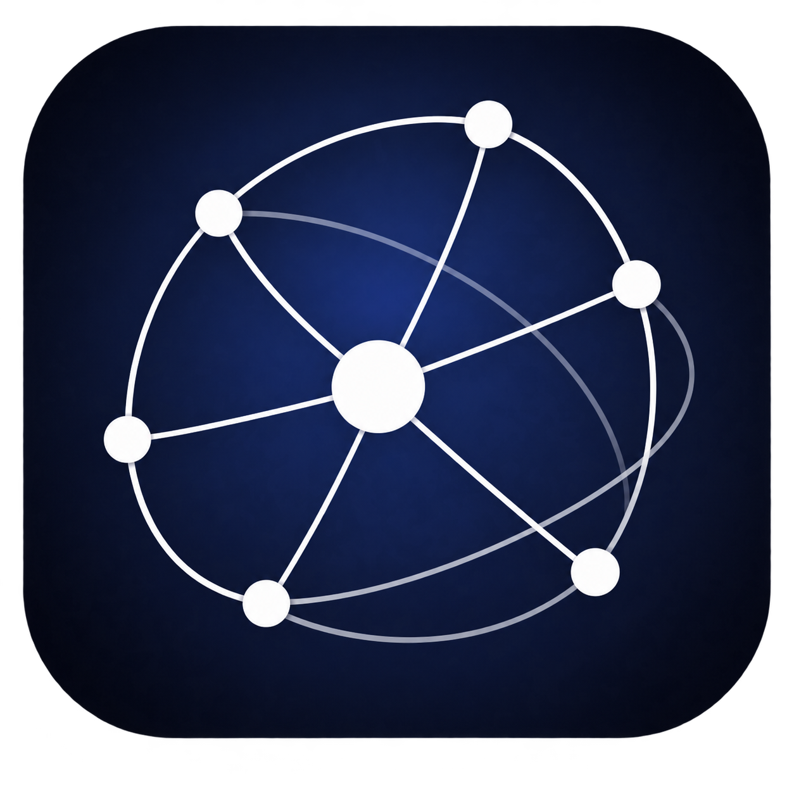

<div align="center">
  

# Orbit

### Record your ideas in 3D

  <p>
    
    
    
    
  </p>

  <a href="https://orbit-notes.vercel.app/">
    
  </a>
</div>

## 소개

**Orbit**은 노트를 작성하고 노트 사이의 관계를 3D 그래프로 탐색할 수 있는 데스크톱 중심의 노트 애플리케이션입니다. 노션과 비슷한 편집 경험에 3D 지식 그래프를 결합해, 아이디어의 구조와 연결 관계를 시각적으로 확인할 수 있도록 만들었습니다.

Google 계정으로 로그인하면 사용자별 Orbit 워크스페이스가 생성되며 작성한 노트는 Supabase에 저장됩니다. 로그인 전에는 예시 그래프를 자유롭게 탐색할 수 있습니다.

> 현재 모바일 환경은 공식 지원 범위에 포함하지 않습니다. 데스크톱 브라우저 사용을 권장합니다.

## 주요 기능

- **3D 지식 그래프** — 노트와 노트 사이의 관계를 공간 위에서 탐색합니다.
- **다양한 레이아웃** — 기본, 구형, Helix, 카테고리, 태그 레이아웃을 지원합니다.
- **군집 시각화** — 카테고리와 태그별 노드 그룹을 은은한 영역으로 구분합니다.
- **관계 흐름 표현** — 부모에서 자식으로 이어지는 연결선과 흐름 효과를 제공합니다.
- **노션 스타일 에디터** — 제목과 본문, 헤딩, 목록, Todo, 코드, 정렬, 색상을 편집할 수 있습니다.
- **노트 속성 관리** — 카테고리 자동완성, 신규 카테고리 생성, 태그 칩 입력을 지원합니다.
- **계층형 노트 목록** — 부모·자식 구조의 노트를 펼치고 닫으며 관리할 수 있습니다.
- **그래프 탐색 도구** — 필터, 카메라 회전, 줌, 노드 선택 기능을 제공합니다.
- **사용자별 워크스페이스** — Google OAuth와 Supabase RLS로 사용자 데이터를 분리합니다.

## 기술 스택

### Frontend

<p>
  
  
  
  
  
</p>

### 3D Graph

<p>
  
  
  
  
  
</p>

### Editor

<p>
  
  
</p>

### Backend & Authentication

<p>
  
  
  
  
</p>

### Code Quality & Architecture

<p>
  
  
  
</p>

## 프로젝트 구조

Feature-Sliced Design을 기준으로 앱 조합, 도메인, 사용자 기능, 공용 코드와 독립 UI 블록을 분리했습니다.

```text
src/
├─ app/                         # 앱 초기화, Provider, 전역 스타일
│  ├─ providers/
│  ├─ styles/
│  └─ ui/
├─ entities/                    # 핵심 도메인 모델과 데이터 접근
│  ├─ note/
│  │  ├─ lib/layout/            # 그래프 레이아웃 계산
│  │  └─ model/
│  └─ workspace/
│     ├─ api/
│     └─ model/
├─ features/                    # 사용자 행동 중심의 기능
│  ├─ auth/
│  └─ note-editor/
├─ shared/                      # 도메인에 종속되지 않는 공용 코드
│  ├─ api/supabase/
│  ├─ styles/
│  └─ types/
└─ widgets/                     # 독립적인 화면 구성 블록
   └─ orbit-graph/
      ├─ lib/
      ├─ model/
      └─ ui/
```

각 slice는 `index.ts`를 공개 API로 사용하며 ESLint가 FSD 레이어의 역방향 의존성을 검사합니다.

```text
app → widgets → features → entities → shared
```

- `shared`는 상위 레이어를 참조할 수 없습니다.
- `entities`는 `features`, `widgets`, `app`을 참조할 수 없습니다.
- `features`는 다른 feature 또는 상위 레이어를 참조할 수 없습니다.
- 다른 slice의 내부 파일 대신 공개 `index.ts`를 통해 import합니다.

## 커밋 컨벤션

Conventional Commits 형식을 사용하되 변경 내용은 한국어로 작성합니다.

```text
type: 변경 내용
```

### 타입

- `feat`: 새로운 기능
- `fix`: 오류 수정
- `refactor`: 기능 변화가 없는 구조 개선
- `style`: UI 또는 CSS 변경
- `perf`: 성능 개선
- `chore`: 설정, 의존성, 빌드 작업
- `docs`: 문서 변경
- `test`: 테스트 추가 및 수정

### 작성 규칙

- `type`은 영문 소문자로 작성합니다.
- 변경 내용은 간결한 한국어로 작성합니다.
- 문장 끝에 마침표를 붙이지 않습니다.
- 하나의 커밋에는 하나의 목적만 담습니다.

### 예시

```text
feat: 노트 생성 기능 추가
fix: 노드 선택 해제 시 카메라가 초기화되는 문제 수정
style: 에디터 툴바 스타일 개선
perf: 화면이 숨겨졌을 때 렌더링 중단
refactor: 워크스페이스 상태와 Provider 분리
chore: FSD 레이어 의존성 검사 추가
docs: 프로젝트 설명과 기술 스택 추가
```

---

<div align="center">
  아이디어를 공간에 기록하고, 연결을 탐색합니다.
</div>
